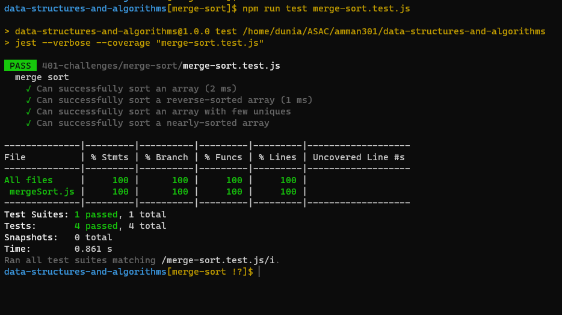

## Code Challenge: Class 27 / Merge Sort - JS Implementation

#### Introduction

---

**Merge Sort is a sorting algorithm that splits up the values of an array and then merges them in a sorted order. It is a very efficient sorting algorithm - O(n log n).**

---

### Whiteboard

### Efficiency

---

Time: O(n log n)
Space: O(n)

---

### Tests :

