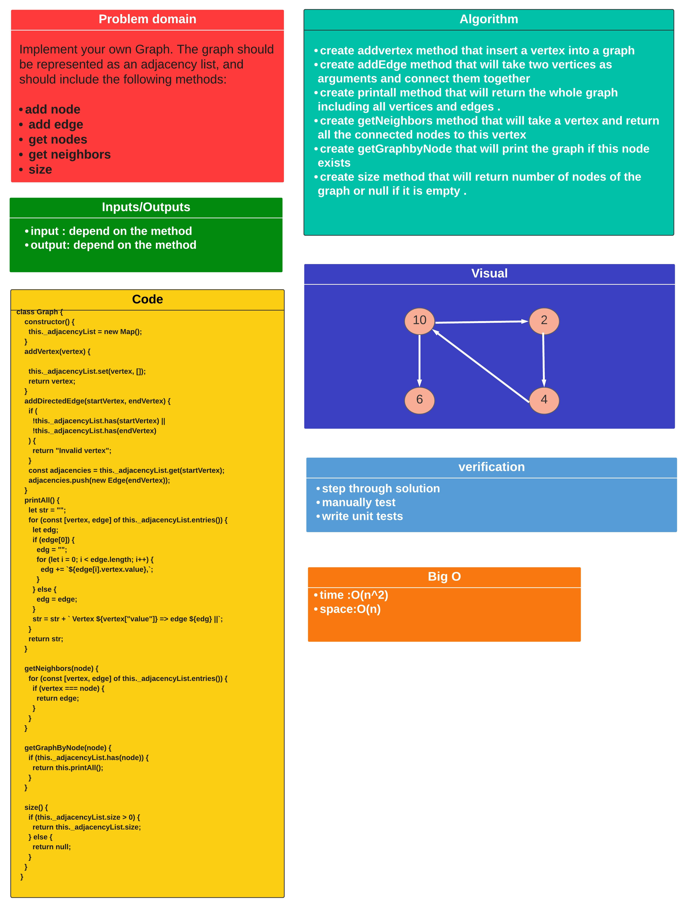
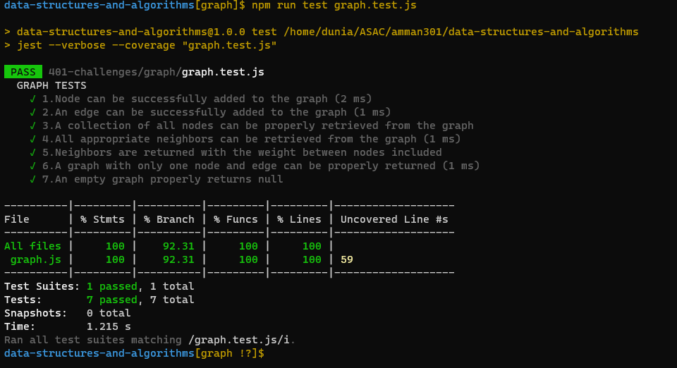

# Code Challenge: Class 35 / Implementation: Graphs:

## Challenge

### implementation of Graph methods :

#### Implement your own Graph. The graph should be represented as an adjacency list, and should include the following methods:

- #### add node

- #### add edge

- #### get nodes

- #### get neighbors

- #### size

## Approach

- ### I understood the problem first
- ### I imagined how the results should be
- ### I made a drawings of how the hashTable would be after insertion of multiple key and values.
- ### I wrote the code
- ### I made the tests

## Efficiency

- ### time : O(n^2)
- ### space : O(n)

## API

- ### add node : Arguments: value Returns: The added node Add a node to the graph

- ### add edge : Arguments: 2 nodes to be connected by the edge, weight (optional) Returns: nothing Adds a new edge between two nodes in the graph ,If specified, assign a weight to the edge ,Both nodes should already be in the Graph

- ### get nodes : Arguments: none Returns all of the nodes in the graph as a collection (set, list, or similar)

- ### get neighbors : Arguments: node Returns a collection of edges connected to the given node,Include the weight of the connection in the returned collection

- ### size : Arguments: none Returns the total number of nodes in the graph

## Testing

### [Tests](graph.test.js)

