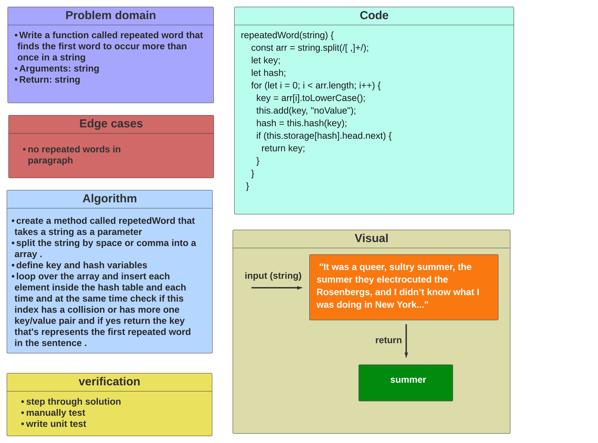
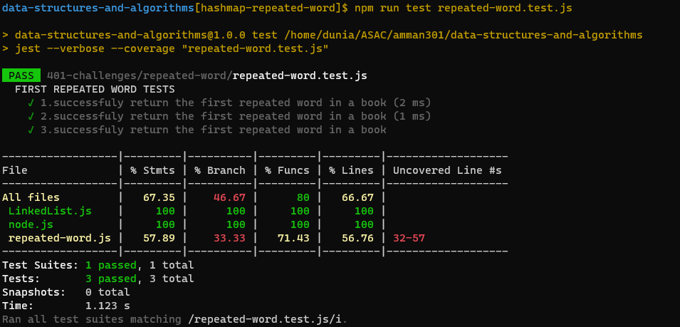

# Code Challenge: Class 31 / hashmap-repeated-word

## Challenge

### Write a function called repeated word that finds the first word to occur more than once in a string,Arguments string and Return string.

## Approach

- ### I understood the problem first
- ### I imagined how the results should be
- ### I made a drawings of how the hashTable would be after insertion of multiple key and values.
- ### I wrote the code
- ### I made the tests

## Efficiency

- ### time :O(n)
- ### space : O(n)

## API

- ### Hashtable

  - repeatedWord(string) : This method Finds the most repeated word in a book.

## Testing

### [Tests](https://github.com/Duniaalkilany/data-structures-and-algorithms/tree/main/401-challenges/repeated-word/repeated-word.test.js)

