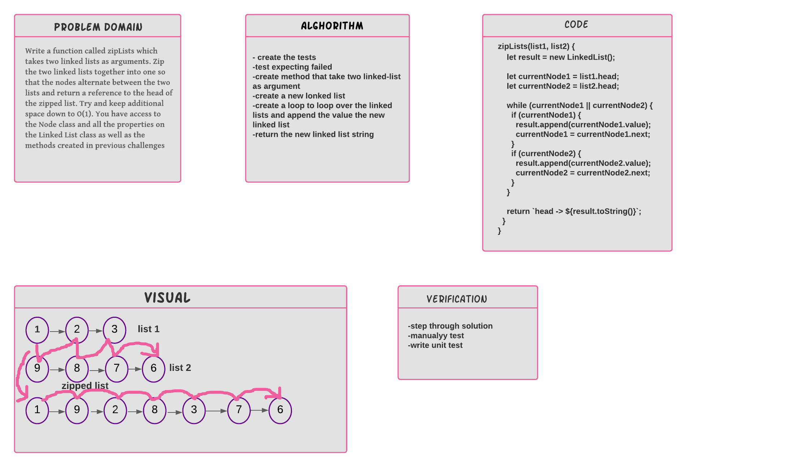

**Challenge Summary**

---

You are given two linked list and you should write a function to zip the two lists in one ( the nodes alternate between the two lists ). return a reference to the head of the zipped list.

---

**Whiteboard Process**

---

**Approach & Efficiency**

save first linked list node (head) in currentFirst

save second linked list node (head) in currentSecond

move on the first linked list (loop)

make the currentFirst points on the currentSecond and currentSecond points on the currentFirst.next

update currentFirst to be equal currentFirst.next.next

update currentSecond to be equal currentSecond.next

Time O(N)

Space O(1)

---
