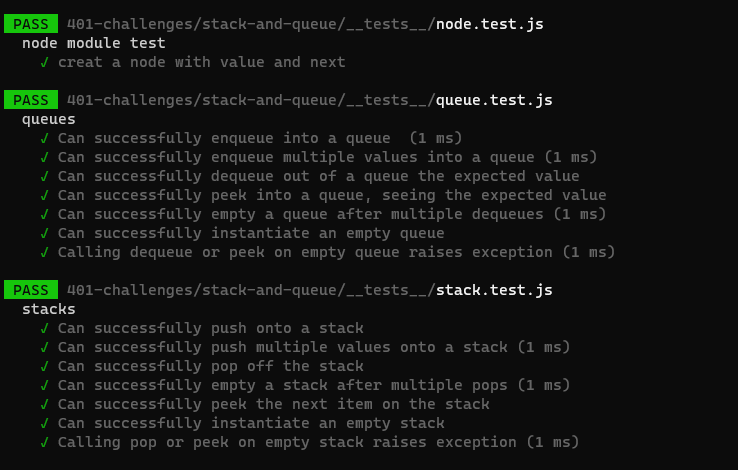

# tacks and Queues

**Using a Linked List as the underlying data storage mechanism, implement both a Stack and a Queue.**

### Challenge

Challenge Description - Stacks and Queues Implementation

- Create a Node class that has properties for the value stored in the Node, and a pointer to the next node.
  Create a Stack class that has a top property and the folowing method:
- push method, pop method, peek method, and an isEmpty method
- Create a Queue class that has a front property and the following methods:
  - enqueue, dequeue, peek, and isEmpty

---

### Approach & Efficiency

understood the problem first
I imagined how the results should be
I wrote the code
I made the tests
[

time: O(1)
space: O(1)
]

### API

**stack**

- push(value) : adds a new node with that value to the top of the stack with an O(1) Time performance.
  pop() : Removes the node from the top of the stack
  peek() : Returns the Value of the node located at the top of the stack
  isEmpty() : Returns a boolean indicating whether or not the stack is empty.

**queue**

- enqueue(value) : adds a new node with that value to the back of the queue with an O(1) Time performance.
  dequeue() : Removes the node from the front of the queue
  peek() : Returns the Value of the node located at the front of the queue
  isEmpty() : Returns a boolean indicating whether or not the queue is empty

### testing

