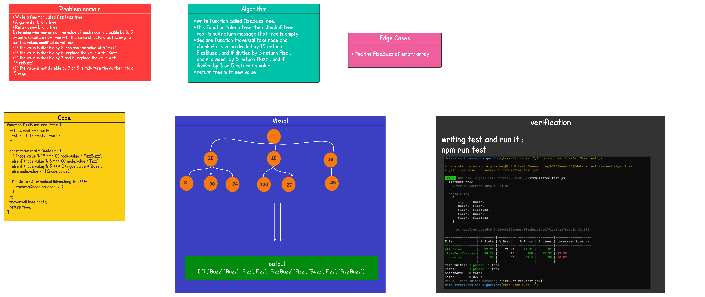

## Challenge Summary

### Write a function called fizz buzz tree, Arguments: k-ary tree ,Return: new k-ary tree

## Whiteboard Process

## Approach & Efficiency

- ### understood the problem first
- ### I imagined how the results should be
- ### I wrote the code
- ### I made the tests

* ### breadthFirst(tree)

  - ### time : O(n)

  - ### space O(n)

## API

- ### breadthFirst(tree) : returns a list of all values in the tree level by level

- ### fizzBuzzTree (tree) : return new tree with Buzz or Fizz or FizzBuzz or its value.
