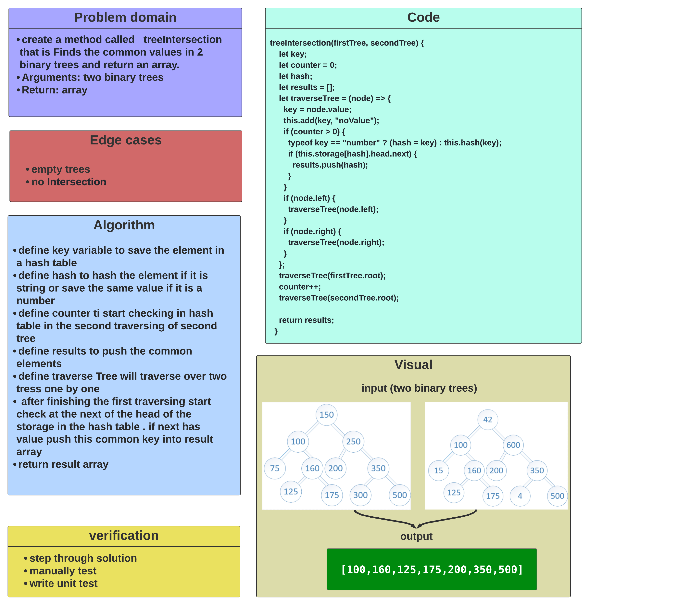
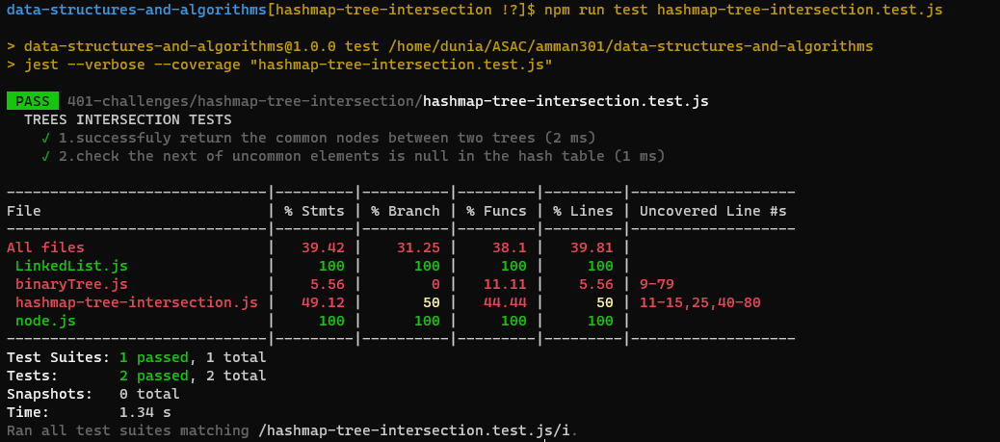

# Code Challenge: Class 32 / hashmap-tree-intersection

## Challenge

### create a method called treeIntersection that is Finds the common values in 2 binary trees and return an array.

## Approach

- ### I understood the problem first
- ### I imagined how the results should be
- ### I made a drawings of how the hashTable would be after insertion of multiple key and values.
- ### I wrote the code
- ### I made the tests

## Efficiency

- ### time : O(n)
- ### space : O(n)

## API

- ### Hashtable

  - repeatedWord(string) : This method Finds the most repeated word in a book.

