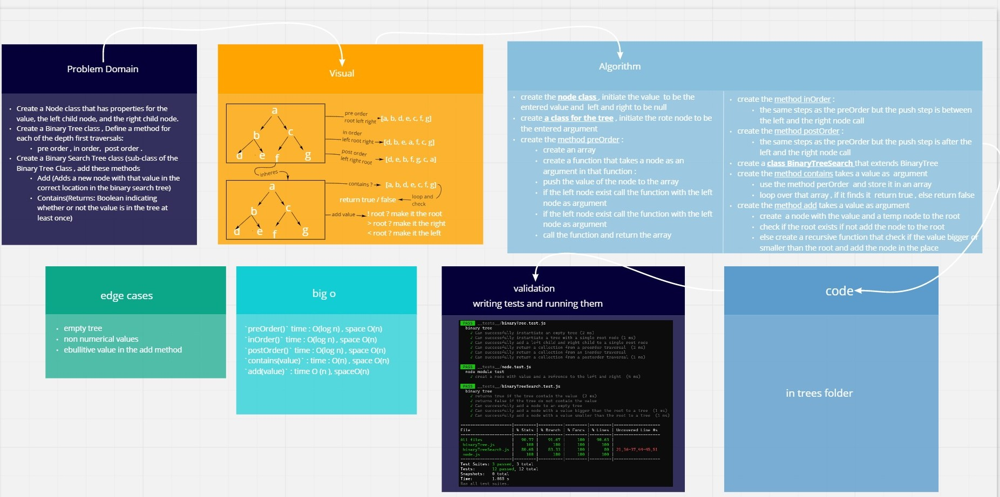

## Trees

- **A tree data structure is a non-linear data structure because it does not store data in a sequential manner. It is a hierarchical structure as elements in a Tree are arranged in multiple levels.**

---

## Challenge

**implenting binary tree and binary search tree**

---

## Approach & Efficiency

Implementing depth traverse of binary tree using recursion.
The Big O of this implementation:

BinaryTree

preOrder() time : O(log n) , space O(n)
inOrder() time : O(log n) , space O(n)
postOrder() time : O(log n) , space O(n)

BinarySearchTree

contains(value) : time : O(n) , space O(n)
add(value) : time O(n), spaceO(n)

---

**API** :

- pre_order method
- in_order method
- post_order method
- add method
- contains method

